# Blood Giver Register
The program helps the user handle a blood giver register. 

### User Stories
0. The list is stored in a **textfile** consisting of 6 columns:

| Primary Keys | Names | Blood Groups | E-mail | Addresses | No. of blood donations | Date of the last donation |
|--------------|-------|--------------|--------|-----------|------------------------|---------------------------|
|              |       |              |        |           |                        |                           |
|              |       |              |        |           |                        |                           |
|              |       |              |        |           |                        |                           |

1. Parts of your program has to be stored in different files (e.g functions in a file called functions.c, the type of functions in functions.h and finally, function main in main.c). In case of an error, each block has to inform the user and offer a possibility of another trial. 
2. The program has to be given the name of the file (to be handled) in command line. 
3. The program has to check the number of the persons in the list (in the text file) and allocate an area in the memory with a proper size for the *dynamic structure array*. 
4. The program has to fill the array with data from the text file. 
5. The program has to inform the user about these events. 
6. The program has to enumerate its possibilities
   * printing the list
   * Adding a new member to the list
   * Searching for a given blood group, warning the member found in the list by sending her/him an e-mail. Incrementing the number of blood donations in the list and overwriting the date of blood donation in both the structure array and the file. 
7. It has to execute the selected option. 
8. It has to offer an option to continue the program, and in case of a "y" answer, it has to show the options again. 
9. E-mail addresses have to be checked (considering . and @ characters and their positions). If there is a mistake in the file, the program has to inform the user. 
10. The date has to be stored in one piece of string, its valid: **2019.04.03.** Only this format can be accepted! In case of finding a mistaken date format in the file, the program has to inform the user. 
11. Only those blood givers whose last date of donation is older than 90 days may give blood! Calculate the date between the actual date and the date of the last donation. Inbuilt functions (form *string.h* and *math.h* can't be used for this part of the task, where the number (in the string) has to be converted to an int type variable. Write your own function for this operation !!)

## Program Demo
1. The user enters the name of the program and the text file as command line arguments.

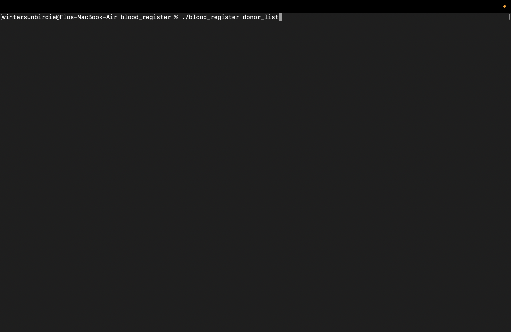

2.The program prompts the user for the current date.

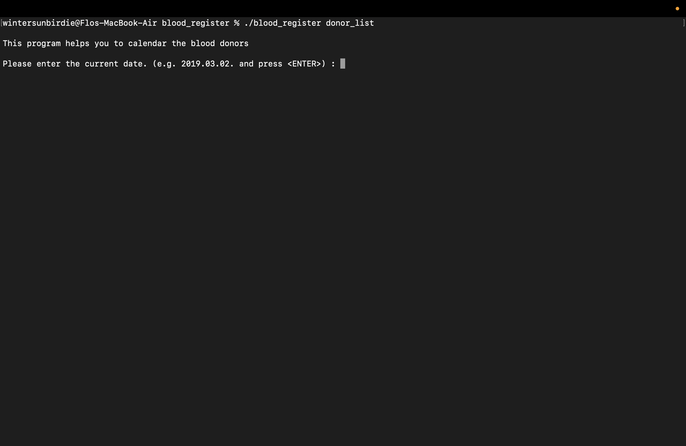

3. The user enter the current date. 

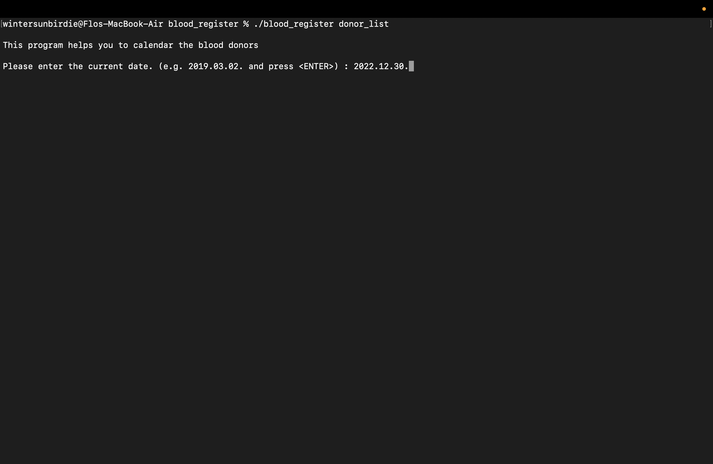

4. The program reads the file into memory and notify the user of the processes it has undertaken. 

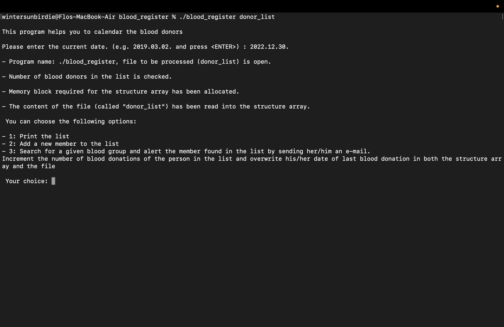

5. The user selects the first option.

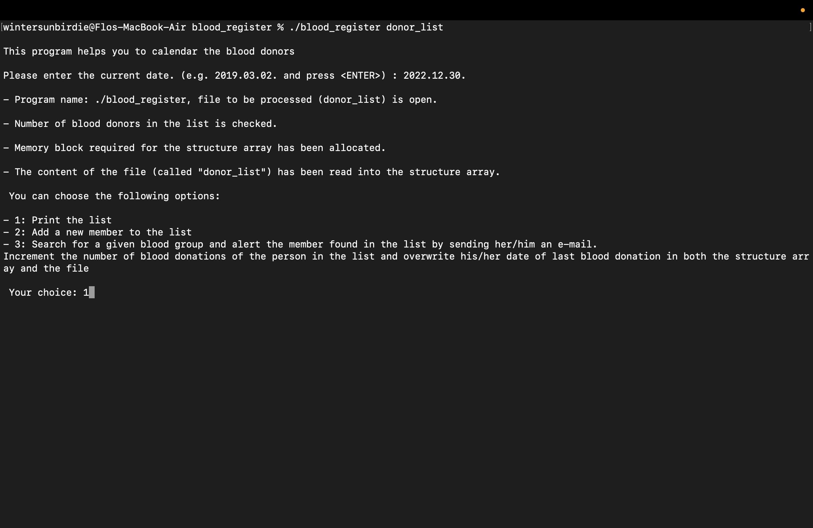

6. The program prints the list of registered blood donors and asks the user whether to continue. 

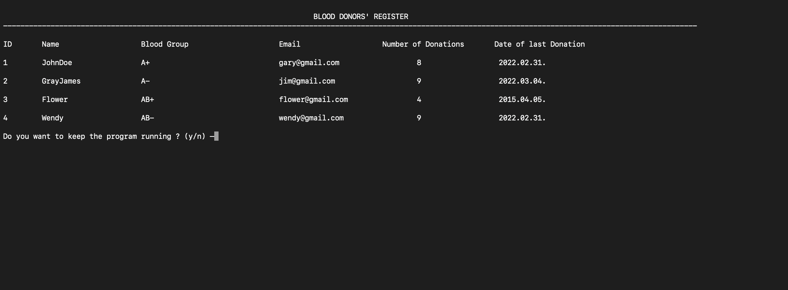

7. The user selects the second option.

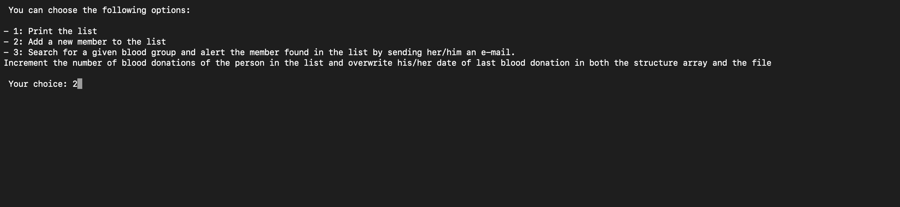

8. The user adds a new donor. 

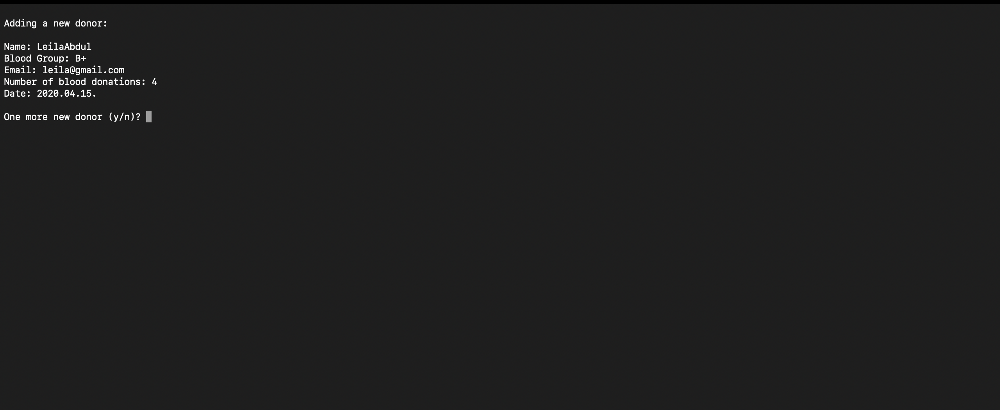

9. The program asks the user whether to add another donor and adds one more donor. 

10. The user declines the option to add another donor.  

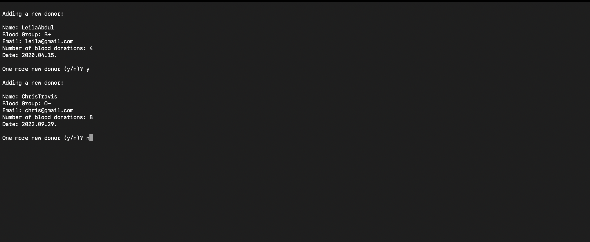

11. The program asks the user whether or not to continue. 

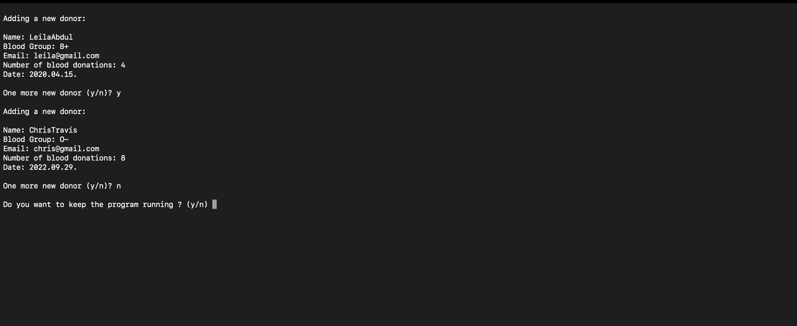

12. The user picks the first option. 

13. The program prints out the augmented list with the added donors. 

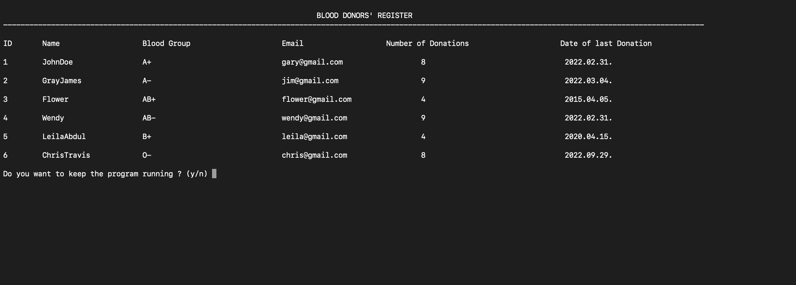

14. The user agrees to continue the program by selecting y. 

15. The user selects the third option. 

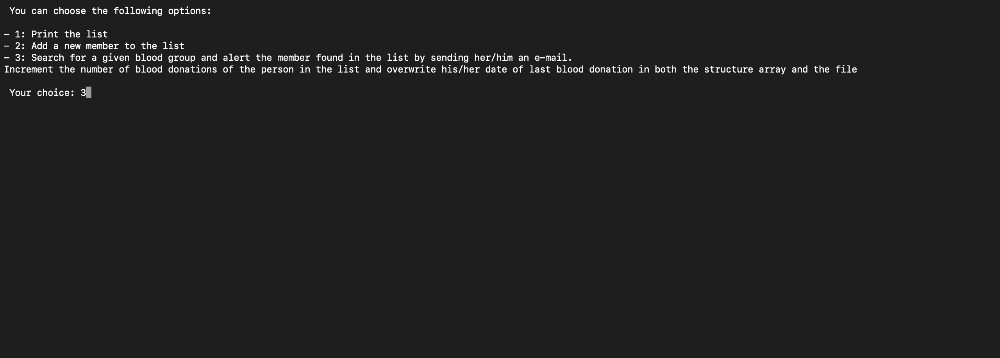

16. The user enters the blood group they need.

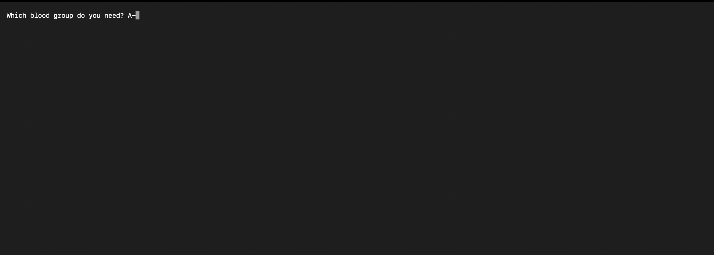

17. The program prints the list of the available donors and who can/cannot donate. 

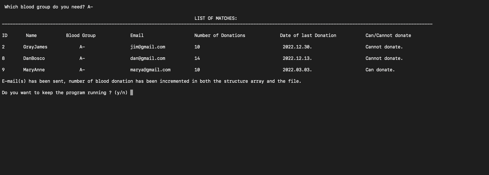

18. The user chooses to continue with the program by selecting y.

19. The user selects the first option. 

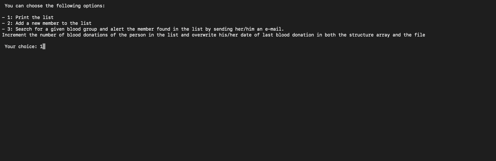

20. The program printst the updated list with the last donation date updated and donation count incremented. 

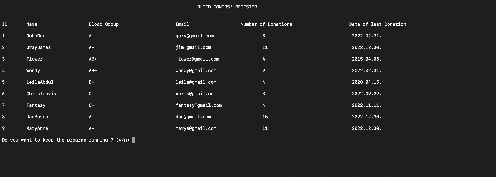

21. The user declines the option to continue with the program by selecting n. 

22. The program quits.

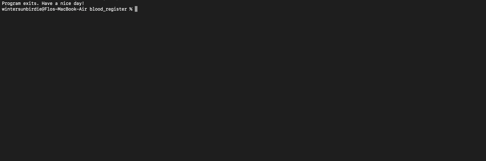

The Final Text File.
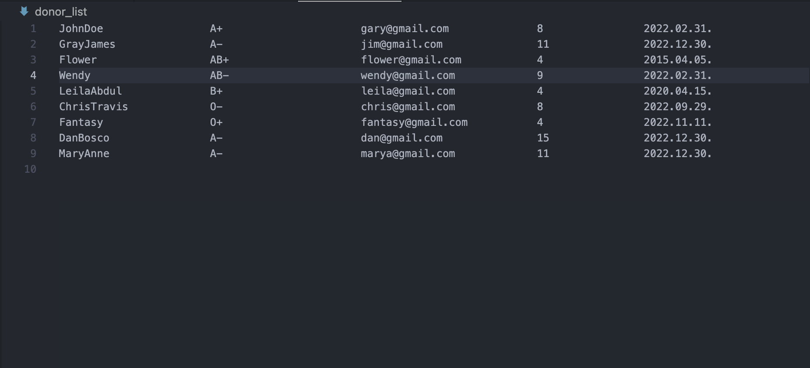
### Asumptions
An eligible donor is assumed to have donated blood. 

### Future Plans
1. Update the date difference calculation to handle leap years and to consider the maximum values of the months and days. Currently, each month is considered as a 30-days-month. 
2. Blood donors with an anniversary should be filtered and can be prized. 
3. Analyze the statistics: How often the members give blood, who donated the most blood, etc.
